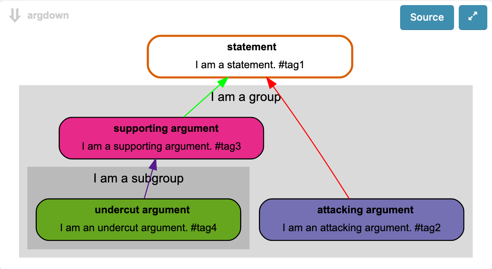
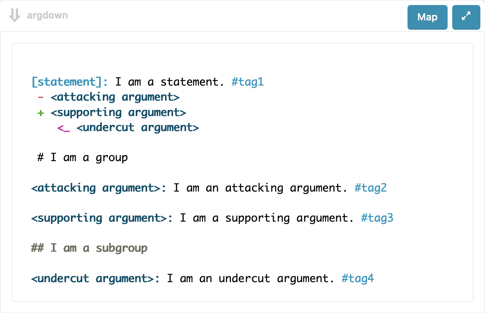

# Argdown

This extension allows [MediaWiki](https://www.mediawiki.org/wiki/MediaWiki) users to write arguments in [Argdown](https://argdown.org/). It will automatically generate argument maps using [Argdown's official engine for Node.js](https://github.com/christianvoigt/argdown). Since Argdown is text-based (like Markdown or Wikitext), you can use MediaWiki's version-tracking functionality to see how arguments evolve over time and get an argument map for each version.

## Setup

1. Install [Node.js](https://nodejs.org), version 13 or higher. As of this writing, `apt` doesn't have that version yet; I recommend following options 2 or 3 from [this guide](https://www.digitalocean.com/community/tutorials/how-to-install-node-js-on-ubuntu-20-04#option-2-%E2%80%94-installing-nodejs-with-apt-using-a-nodesource-ppa).
2. [Download the extension](https://github.com/DawnPaladin/Argdown-for-MediaWiki/releases/latest) and unzip it into the folder `mediawiki/extensions/Argdown`
3. `cd` to the `mediawiki/extensions/Argdown` folder and run `npm install` to install the Argdown engine
4. Run `which node` and put the result in `mediawiki/extensions/Argdown/extension.json`, under `config/NodeJsPath/value`. (The extension needs to know the path to your Node.js executable and may not be able to get it from your $PATH.)
5. In `mediawiki/LocalSettings.php`, add this line: `wfLoadExtension( 'Argdown' );`
6. If you'd like a toolbar button for Argdown, add this line too: `wfLoadExtension( 'WikiEditor' );`
7. Navigate to Special:Version on your wiki to verify that the extension is installed.
8. Try it out! Copy this block of code into a wiki page and click "Show preview" to see if you get an argument map:

```
<argdown>
[statement]: I am a statement. #tag1
 - <argument 1>
 + <argument 2>
    <_ <argument 3>
</argdown>
```

If nothing appears when you test the extension, most likely the extension needs more memory. By default, PHP allocates 30 MiB of memory to shell commands, which isn't enough to run Node.js. 

To check whether this is the problem, try putting this line in `mediawiki/LocalSettings.php`: `$wgMaxShellMemory = 0;` This will disable the memory limitation. You probably don't want to do that long-term, so if setting `$wgMaxShellMemory` to 0 allows Argdown to appear, try setting it to 20000000 and increase it from there until it works.

If `$wgMaxShellMemory = 0;` doesn't work, please [open a GitHub issue](https://github.com/DawnPaladin/Argdown/issues) and perhaps I can help you find a solution.

## Usage

When editing any wiki page, wrap your argument in `<argdown>` `</argdown>` tags and they'll be formatted in Argdown. 

If you're using [WikiEditor](https://www.mediawiki.org/wiki/Extension:WikiEditor), click this button in the toolbar to insert the Argdown tags:


Once you save the page, you'll see an automatically-generated map of your argument, like so:



You can click the "Source" button in the corner to see the your argument in written form:



For more information on composing arguments in Argdown, please see [the official guide](https://argdown.org/guide/creating-argument-maps.html) and [syntax reference](https://argdown.org/syntax/).

## Supported skins

- Vector (MediaWiki default skin)
- Timeless
- Tweeki

Other skins may also work, but sometimes the behavior of the "maximize" button needs to be adjusted for each skin. If this happens to you, please [open a GitHub issue](https://github.com/DawnPaladin/Argdown-for-MediaWiki/issues).

## Known bugs

If you have more than one argument map on your page, you will see the error `Uncaught DOMException: CustomElementRegistry.define: 'argdown-map' has already been defined as a custom element`. This should not affect functionality.

## Debugging

This plugin is still under development. If something goes wrong, enabling logging may help to figure out what's going wrong.

To set up the log file, add this to your `LocalSettings.php`:

```php
$wgDebugLogGroups = array(
	'argdown' => 'extensions/Argdown/argdown.log'
);
```

This will create an `argdown.log` file in the extension folder.

## Feedback

If you'd like to report a bug or provide other feedback, please [open a GitHub issue](https://github.com/DawnPaladin/Argdown-for-MediaWiki/issues).

Last tested with MediaWiki 1.35.1 and Argdown 1.5. 
